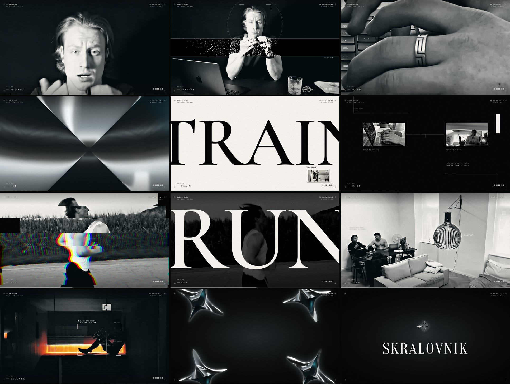

# SKRALOVNIK — personal film (v1)

Anže's 8-second personal landing video (8 shots, 4K, 30 fps), rebuilt as a 10-second motion-design
piece: Y2K chrome, hard black-and-white contrast, fine technical graphics and a tech-glitch edit,
scored with SFX only (the camera sound is removed). It is built with the same tools as the Tessel
film below: the picture in Remotion, the sound synthesized in Python, both reading one timeline.

[](video/skralovnik-v1.mp4)

**Watch:** [`video/skralovnik-v1.mp4`](video/skralovnik-v1.mp4) (master, 1920×1080, 30 fps, AAC 320 kb/s) ·
[`video/skralovnik-v1-web.mp4`](video/skralovnik-v1-web.mp4) (8 Mb/s, for the website).

**The idea.** The day is a system being scanned by a chrome instrument. The eight chapters from the
website (Present · Build · Train · Build · Run · Team · Recover · Repeat) keep their cuts, and each
shot gets the same grammar: a transition hit on the cut, brackets that lock onto the subject
(tracked with pose landmarks, the ring with optical flow), one- and two-frame interruptions
(x-ray negative, a 4K punch-in, a 1-bit frame, the chapter word too big for the frame, a frame of
real colour, a system frame), and one texture that travels (scan band, film strip, smear, contour,
a wireframe globe set inside the pendant lamp). The brand sparkle is a real 3D chrome object: it
wipes two cuts by swelling through the lens and, at the end, four of them lock into the SKRALOVNIK
symbol above the wordmark from `logo.svg`. The only colour is the sauna's heat.

**Sound.** An original SFX palette built in rounds, no samples, no tonal beeps, sweeps, bells,
drums or reverb. Round 1 ([`sfx/skralovnik/round1/`](sfx/skralovnik/round1/)) tested three dry
mechanical-digital prototypes (A SHUTTER, B LOCK, C GRAIN). Round 2
([`sfx/skralovnik/round2/`](sfx/skralovnik/round2/)) follows the feedback: families of variants so
nothing repeats, more metal and spring in the lock, and a pattern per scene with fewer, mostly soft
sounds and four strong ones. Each round has its cue sheet, a level-matched audition reel, the
individual 48 kHz / 24-bit WAVs and QC (peaks, clean endings, mono compatibility).

**Checks on every render** (`scripts/skralovnik/post.py`): audio sync to the sample, true peak after
the AAC encode at or under −1 dBTP, and a flash scan (at most 2 full-frame luminance flashes in any
second; WCAG 2.3.1 allows 3).

```bash
npm run skralovnik   # plates → timeline → 4K punch-ins → SFX → frames → grain + master + checks
```

Needs `ffmpeg` (with libx264) on the PATH and Python with
`numpy scipy opencv-python-headless pillow soundfile pyloudnorm` (plus `mediapipe` only if
`public/skralovnik/track.json` is deleted and tracking has to run again).

```
src/skralovnik/        timeline.ts (events → looks and cues), Film, Plate, Sys, Hud, Lock,
                       Textures, Chrome (Three.js sparkle), Outro
scripts/skralovnik/    prep.py (grade, dither, tracking, punch-ins), export-cues.ts, sfx.py,
                       post.py, render.sh
public/skralovnik/     source footage, logo / symbol / wordmark SVGs, track.json
sfx/skralovnik/        SFX round 1 deliverables
```

---

# Tessel — launch film

A 33-second launch film for **Tessel**, a fictional product: *the calendar that plans itself.*
Everything you see and hear is generated from code in this repo. The picture is built with
[Remotion](https://www.remotion.dev) (React → frames), and the soundtrack is synthesized in Python.
It uses no stock footage, no samples and no templates.

[](video/tessel-launch.mp4)

**Watch:** [`video/tessel-launch.mp4`](video/tessel-launch.mp4) (33 s, 1920×1080, 60 fps, H.264 with temporal motion blur, stereo AAC 320 kb/s).

---

## The idea

Your week doesn't fit. Tessel fits it.

The film is one continuous relay. A single red dot, the calendar's *now* marker, is handed from
shot to shot and never leaves the screen:

| Time | Act | What happens |
| --- | --- | --- |
| 0:00 | **Doesn't fit** | The film opens on a full red field that irises down onto the *now* dot, and the dot starts ticking like a Swiss clock as the day draws out of it. Meetings rain in from 1.5s and pile up, faster and faster. "doesn't fit." slams in too big for the frame, then everything implodes back into the dot. |
| 0:06 | **Mark** | The dot's shockwave floods the frame black. Two blocks snap around it to form the Tessel mark, and the wordmark slides out from behind it. The camera dollies in while the dot keeps the clock on every beat, then the wordmark tucks back behind the mark. |
| 0:09 | **Logo becomes product** | The tall block opens into the app's sidebar and the square into the calendar, and the overbooked week loads inside them as they open. The dot flies to the red *now* line: Monday, 08:42. |
| 0:10 | **Prompt** | The week's clashes flash day by day on the downbeat. The command bar lifts off the app toward the lens, and *"Protect my mornings. Gym Tue + Thu. Ship the deck by Friday."* is typed. Each new letter arrives in red and settles to ink. Click. |
| 0:14 | **The fitting** | The red field closes like a shutter into the *now* line. On a tabletop view of the week, every block lifts, flies and lands on the beat. Meetings that don't fit drift off to next week, and ink focus blocks drop in. The camera straightens on a clean week: *Week planned*. |
| 0:18 | **Features** | The window splits open on its sidebar seam: the sidebar widens into a column for the words and the week swings open on a hinge and dives in full-bleed. One line clicks home per bar. *Meetings move over.*: Roadmap lifts off Thursday and lands on Friday 15:00, and its attendees' checks pop. *Mornings stay yours.*: an invite falls onto Monday's deep work, is knocked aside and rebooked for Friday. *Overruns fit too.*: the clock races to the afternoon, a review runs 30 min over, and the rest of Monday shifts down. The week swings shut back into the window. |
| 0:24 | **Everything fits.** | Pull back. Neighbouring weeks tessellate around ours in a wave, each one packing itself, and then the gaps close into one surface. The two words slide in, and the *now* dot hops out of the week to land as their period. Each word is struck through with ink, the lines swell into the mark's two blocks, and the period drops into the dot's slot. Lockup, and the clock ticks twice. |

## Brand

- **Name:** Tessel, from *tessellation*: pieces that fit together with no gaps.
- **Mark:** three pieces that tile one square. A tall block, a square block, and the red *now* dot.
  It has one fully rounded corner, which makes it read at 16 px.
- **Palette:** ink `#0B0B0C`, paper `#FFFFFF`, cool neutrals, and one accent, red `#EC2A3A`,
  used only for *now* and for things that just happened.
- **Type:** Geist (sans) and Geist Mono. No serif, no italics.

## Sound

`scripts/soundtrack.py` synthesizes the whole score and every sound effect from oscillators and
noise (PolyBLEP saws, FM bells, filtered noise, convolution reverb, sidechain, limiter).
It reads `out/cues.json`, which is exported from the **same timeline the picture uses**,
so every tick, snap, key click and block landing sits on its exact frame.

- 120 BPM, A♭ major (IV – I/3 – vi – V), one bar per chord.
- A tuned Swiss-clock tick-tock (A♭7 / E♭7) is the sonic signature: it starts the film, keeps time through the logo hold and ends it.
- The drops sit on the ink flood (0:06) and on the fitting (0:14). The resolution lands on the "fits." snap (0:28).
- Mastered to −14 LUFS integrated, with a true-peak ceiling of −1 dBTP measured after the AAC encode.

## Run it

```bash
npm install
npm run studio            # interactive preview
npm run render            # final: cues → soundtrack → sub-frames → motion-blur accumulation → mux → sync check
npm run render:preview    # same, without motion blur (≈6× faster)
```

**Motion blur** is done the way a film camera does it. A sharp render is measured with optical
flow (`scripts/measure-speed.py`), and every frame gets enough samples across a 240° shutter that
neighbouring samples are at most 3 px apart (up to 48 on the fastest moves, one on still frames).
Remotion renders those sub-frames (the `LaunchSub` composition), and `scripts/accumulate.py`
averages them in floating point, dithers, and quantizes once. Compositing the samples inside
Chromium instead quantizes every sample to 8 bits, which turns soft gradients into contour rings
and tints light greys, so it is not used.

The picture is rendered muted and the soundtrack is muxed with ffmpeg. Remotion's own AAC mux
leaves ~2.5 frames of encoder priming in the stream, and `scripts/check-sync.py` fails the build if
the audio is ever more than 1 ms off.

Python needs `numpy scipy soundfile pyloudnorm`. Rendering uses headless Chromium
(configured in `remotion.config.ts`).

## Layout

```
src/
  timeline.ts          single source of truth: acts + beat-locked cues (60 fps, 120 BPM)
  Launch.tsx           the film (acts in sequence, audio)
  blur.ts, LaunchSub.tsx  motion-blur shutter and the sub-frame stream it needs
  brand/               tokens, the mark
  app/                 the Tessel calendar UI (real, data-driven components) + week data
  acts/                Act1Fit … Act6End
  fx/                  rack focus, word reveals, cursor
  lib/                 easing library, springs, font gate, DOM text measurement
scripts/
  export-cues.ts       exports every sync point for the soundtrack
  soundtrack.py        score + sound design synthesizer
  render.sh            render (optionally motion-blurred) + ffmpeg mux + sync check
  measure-speed.py     optical flow → motion-blur samples per frame
  make-backdrops.py    pre-dithered glow and table backdrops (public/fx/)
  accumulate.py        averages sub-frames into the motion-blurred master
  check-sync.py        verifies audio/picture alignment in a rendered file
  sheet.sh             contact sheets for frame-by-frame review
```

Tessel is fictional. Any resemblance to a real product is unintended.

Built end to end with [Claude Code](https://claude.com/claude-code): the brand, the film, the score and the render pipeline.

## License

MIT. See [LICENSE](LICENSE).
